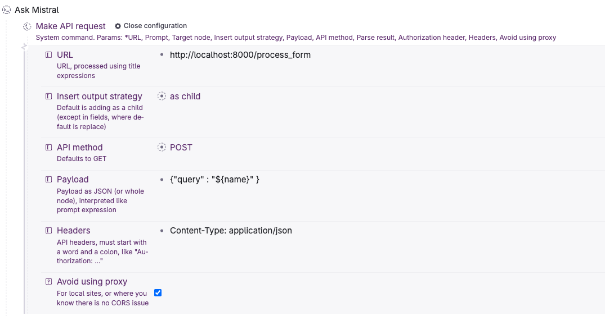

# tana_mistral

* create a `data` directory and store the json file that you 
got from the `tana_ai` output
* open the file and remove the `{ "nodes" :` part and the last `}` in the json file so you are just left with the array of nodes
* change the filename in `index_data.py` to match the filename of your json file
* run `index_data.py` to index your json dump
* run `python app.py` to run the flask app 
* Create a Tana `Command Node` that looks like this:

Now you can write a line of text in Tana and CMD-K "Ask Mistral"